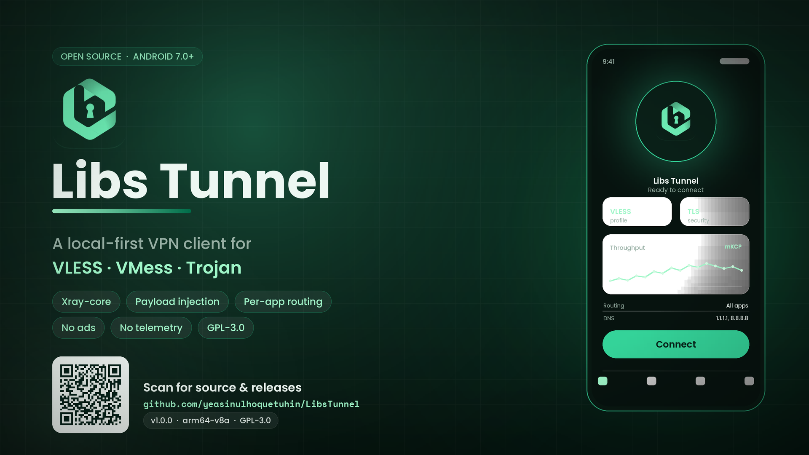

<p align="center">
  
</p>

<h1 align="center">Libs Tunnel</h1>

<p align="center">
  A local-first Android VPN client for VLESS, VMess and Trojan.<br>
  Built with Xray-core, tun2socks, gVisor and Jetpack Compose.
</p>

<p align="center">
  <a href="https://github.com/yeasinulhoquetuhin/LibsTunnel/releases/tag/v1.0.1"></a>
  
  
  <a href="LICENSE"></a>
  <a href="https://github.com/yeasinulhoquetuhin/LibsTunnel/actions/workflows/ci.yml"></a>
</p>

<p align="center">
  <a href="#download">Download</a> &nbsp;&middot;&nbsp;
  <a href="#get-started">Get started</a> &nbsp;&middot;&nbsp;
  <a href="#features">Features</a> &nbsp;&middot;&nbsp;
  <a href="#payload-injection">Payload injection</a> &nbsp;&middot;&nbsp;
  <a href="#build-from-source">Build</a> &nbsp;&middot;&nbsp;
  <a href="#documentation">Documentation</a>
</p>

---

Libs Tunnel lets you create and import connection profiles, route selected
applications through a VPN, and inspect connection events on your device. The
Android client handles the interface, profile storage and VPN permissions; a
Go engine runs the tunnel.

This README describes **the v1.0.1 Android app**. You supply your own server or
connection profile; this repository does not provide a VPN server or account.
The banner is project artwork, and its phone illustration is a mockup.

## Download

**[Download Libs Tunnel v1.0.1 for ARM64](https://github.com/yeasinulhoquetuhin/LibsTunnel/releases/download/v1.0.1/Libs-Tunnel-v1.0.1-arm64.apk)**

| Detail | Published v1.0.1 APK |
| --- | --- |
| Filename | `Libs-Tunnel-v1.0.1-arm64.apk` |
| Version / version code | `1.0.1` / `1001` |
| Package | `com.libsvpn.tunnel` |
| Architecture | `arm64-v8a` |
| Minimum Android | Android 7.0, API 24 |
| Target / compile SDK | API 36 |
| Download size | 53,155,062 bytes, approximately 50.7 MiB |
| Signing | Android debug certificate |

Release notes and the source archive are on the
[v1.0.1 release page](https://github.com/yeasinulhoquetuhin/LibsTunnel/releases/tag/v1.0.1).

### Verify the APK

```text
1bdf727ceaa9b8607089c10a241a6662727b36c1435ed3761339a199e94e9e12  Libs-Tunnel-v1.0.1-arm64.apk
```

```bash
sha256sum Libs-Tunnel-v1.0.1-arm64.apk
adb install Libs-Tunnel-v1.0.1-arm64.apk
```

The published v1.0.0 and v1.0.1 APKs use different signing certificates.
Export any profiles you want to keep before uninstalling v1.0.0, then install
v1.0.1. Uninstalling removes the app's local data.

## Get started

1. Open **Profiles** and choose **New profile** or **Import profile**.
2. For a new profile, enter the server, port, credentials, transport and security
   settings supplied by your server administrator. The new-profile port field
   starts blank.
3. To import a file, choose **Open .libs file**, select it, check the filename
   shown in the import card, then tap **Import**. You can also paste a supported
   share link into the same dialog.
4. Select the profile, return to **Home**, tap **START** and grant Android's VPN
   permission when requested.
5. Use **STOP** on Home or in the notification to disconnect. The notification
   also provides a manual **Reconnect** action.

## Features

### Connections and routing

- VLESS, VMess and Trojan profiles through Xray-core.
- TCP, WebSocket, gRPC, HTTP Upgrade, XHTTP and mKCP transport choices.
- TLS and REALITY configuration, including server name and fingerprint fields.
- Optional payload injection with **Direct** and **Proxy** connection modes.
- Per-app routing: **All apps**, **Only selected**, or **Exclude selected**.
  The app picker lists installed applications with launcher activities.
- The generated Xray routing rules send private/local IP ranges through the
  direct outbound.
- Custom primary and secondary DNS server settings.
- Configurable TUN MTU: default `1500`, validated range `1280` to `9000`.

### Profiles and import/export

- Create, edit, duplicate and delete saved profiles; rename through the editor.
- Import `vless://`, `vmess://` and `trojan://` links, including multiline pastes
  and Base64-encoded lists of supported links.
- Import unencrypted `.libs` files through Android's document picker.
- Export an individual profile from its **three-dot menu** as a `.libs` file,
  or copy the exported JSON to the clipboard.
- Lock/unlock controls in the profile menu. This is an app-level editing and
  deletion restriction, not encryption or password protection.
- Confirmation before deletion, with a guard for the running profile.

**Config format:** `.libs` exports are readable JSON and include the profile's
connection settings and credentials. Exporting does not encrypt them. The file
codec is implemented in
[LibsConfigCodec.kt](android/app/src/main/java/com/libsvpn/tunnel/data/LibsConfigCodec.kt).

### Interface and connection controls

- Home shows the connection state, selected profile, uploaded/downloaded byte
  totals and connection duration. These counters are totals, not a speed meter.
- Separate **Home**, **Profiles**, **Logs** and **Settings** sections.
- Back from a section returns to Home; back from the editor closes the editor.
- Left-aligned app title and an About shortcut in the top bar.
- Light, dark and system themes; seven accents: Green, Blue, Purple, Orange,
  Red, Teal and Pink. Android 12+ dynamic color is optional.
- Action-specific haptic feedback with an on/off setting. Actual vibration
  depends on the device and Android's haptic settings.
- Foreground VPN notification with **Stop** and **Reconnect** actions.
- Optional partial wake lock while connected, exposed as **Keep tunnel awake**.

### Logs

- Search, **All / Errors / Warnings** filters and colored event text.
- Automatic scrolling as new entries arrive.
- Tap a line to copy it; copy or share the visible log list.
- Confirmation before clearing the log view.

The log buffer holds the most recent **250 entries in memory**. The filters
match words in each message; they are not structured Xray log-level filters.

### Local storage

Profiles and settings are stored in the app's private Android DataStore. The
app has no account, advertising, analytics or telemetry SDK in its declared
dependencies. Network traffic still goes to the endpoints and DNS servers used
by your configuration. Exported files and copied text leave app-private storage
when you choose those actions.

## Protocols and transports

These are the choices exposed by the Android profile editor:

| Category | Options |
| --- | --- |
| Protocol | VLESS, VMess, Trojan |
| Transport | TCP, WebSocket, gRPC, HTTP Upgrade, SplitHTTP / XHTTP, mKCP |
| Security | None, TLS, REALITY |
| Payload connection | Direct, Proxy |
| App routing | All apps, Only selected, Exclude selected |

The selected protocol, transport and security combination must also be supported
by your server. Payload injection uses TCP streams; it is not a UDP/mKCP
injector.

See the
[profile model](android/app/src/main/java/com/libsvpn/tunnel/model/TunnelProfile.kt)
and
[configuration builder](android/app/src/main/java/com/libsvpn/tunnel/engine/EngineConfigBuilder.kt)
for the stored fields and generated Xray configuration.

## Payload injection

Libs Tunnel includes a local injector in the Xray connection path. Enable it in
the profile's **PAYLOAD** section, choose a mode and enter a payload appropriate
for your endpoint.

| Mode | Socket destination | Behavior |
| --- | --- | --- |
| **Direct** | Profile server and port | Sends the payload to the target before forwarding Xray's stream. |
| **Proxy** | Configured proxy host and port | Sends the payload to the proxy; target placeholders still refer to the profile server. |

The Android app sends only these two modes. Xray's TLS/REALITY and server-name
settings belong to the underlying protocol connection and are configured
separately in **TRANSPORT**.

### Payload placeholders

| Token | Replacement |
| --- | --- |
| `[host]`, `[port]`, `[host_port]` | Original target host, port, or host-and-port |
| `[method]` | `CONNECT` in the app-generated configuration |
| `[protocol]` | `HTTP/1.1` in the app-generated configuration |
| `[ua]` | Configured user-agent value |
| `[real_raw]` | Original target address in host-and-port form |
| `[crlf]`, `[lfcr]`, `[cr]`, `[lf]` | Line-ending characters |
| `[split]` | Splits the payload into separate writes |
| `[split=N]` | Splits and delays the next write by `N` milliseconds, from `0` to `60000` |

The app's default response handling reads HTTP-like headers and accepts status
`101` or `200` before bridging the stream. A compatible server or proxy must
understand the payload; the template alone does not provide connectivity.
Details are in [docs/CONFIG.md](docs/CONFIG.md) and
[engine/payload.go](engine/payload.go).

## How it works

```text
Routed application traffic
  -> Android VpnService TUN interface
  -> tun2socks / gVisor network stack
  -> local SOCKS5 inbound
  -> Xray outbound
  -> remote server

With payload injection enabled:
  Xray outbound
    -> local injector listener
    -> Direct target or configured Proxy
    -> remote server
```

When injection is enabled, the engine records the original outbound destination
and rewrites that outbound to a localhost listener. The injector opens the
remote TCP socket, writes the payload, processes the configured response and
then bridges the byte stream.

The Android service installs routes and DNS settings. Socket protection and
app-exclusion rules are used to keep the engine's outbound connections outside
the VPN route. See [docs/ARCHITECTURE.md](docs/ARCHITECTURE.md),
[HeadlessVpnService.kt](android/app/src/main/java/com/libsvpn/tunnel/service/HeadlessVpnService.kt)
and [engine/injector.go](engine/injector.go).

## Build from source

### Toolchain

| Component | Repository configuration |
| --- | --- |
| JDK | 17 or 21; the published APK was assembled with JDK 21 |
| Go | `1.26.3` in `engine/go.mod` |
| Android SDK | Platform 36, Build-Tools and accepted SDK licenses |
| Android NDK | Required by gomobile; the build script does not pin an NDK version |
| Gradle | Bundled wrapper: `8.11.1` |
| Android Gradle Plugin | `8.9.2` |
| Kotlin | `2.1.20` |

Use an SDK/NDK toolchain compatible with your host. On ARM64 Linux, the usual
Google Linux AAPT2 binary is x86-64; a compatible binary or an emulation wrapper
is needed. This does not change the APK's `arm64-v8a` target.

### Build commands

```bash
git clone https://github.com/yeasinulhoquetuhin/LibsTunnel.git
cd LibsTunnel

export ANDROID_HOME=/path/to/android-sdk
export PATH="$(go env GOPATH)/bin:$PATH"
chmod +x android/gradlew
mkdir -p android/app/libs

sh scripts/build-engine.sh
sh scripts/build-android.sh
```

The SDK must include an Android NDK installation. The engine script downloads
Go modules, runs the Go tests and uses gomobile to build
`android/app/libs/vpncore.aar` for Android ARM64/API 24. If gomobile is absent,
the script installs gomobile and gobind from its pinned `golang.org/x/mobile`
version.

The Android script assembles the debug variant and writes
`android/app/build/outputs/apk/debug/app-debug.apk`. Generated AAR files are
ignored by Git, so a fresh clone needs the engine build first. The scripts
assemble a debug-signed APK; signing with your own release key requires separate
Gradle signing configuration.

For an AAPT2 override on an ARM64 Linux build host:

```bash
cd android
./gradlew -Pandroid.aapt2FromMavenOverride=/path/to/aapt2 assembleDebug
```

The [CI workflow](.github/workflows/ci.yml) defines Go formatting, vet and test
jobs plus an Android debug-build job. Its current status is shown by the CI
badge above.

## Project layout

```text
LibsTunnel/
  android/               Android app and Gradle wrapper
    app/src/main/java/com/libsvpn/tunnel/
      core/              gomobile bridge
      data/              DataStore repository and .libs/share-link codec
      engine/            Android-to-Xray configuration builder
      model/             Profile fields, settings and validation
      service/           VPN service, commands and runtime state
      ui/                Compose screens and themes
  engine/                Go tunnel engine and tests
    cmd/vpncore/         Command-line entry point
    examples/            Placeholder engine configurations
  scripts/               Engine and Android build scripts
  docs/                  Architecture, build and configuration documentation
  third_party/           Dependency notices
  CHANGELOG.md           Release changes
  CONTRIBUTING.md        Contribution guide
  LICENSE                Project license declaration
  SECURITY.md            Security reporting guide
```

## Documentation

| Document | Purpose |
| --- | --- |
| [Architecture](docs/ARCHITECTURE.md) | Engine, injector, TUN integration and socket protection |
| [Build guide](docs/BUILD.md) | Build scripts and generated artifacts |
| [Configuration](docs/CONFIG.md) | Injection modes, placeholders and response handling |
| [Changelog](CHANGELOG.md) | Version changes |
| [Contributing](CONTRIBUTING.md) | Contribution workflow |
| [Security](SECURITY.md) | Security issue reporting |
| [Dependency notices](third_party/NOTICE.md) | Dependency versions and licenses |

## License

Libs Tunnel declares **GPL-3.0-only** in [LICENSE](LICENSE). The full GPLv3 text
is available from [GNU](https://www.gnu.org/licenses/gpl-3.0.html). Dependencies
retain their own licenses:

| Component | Version in `engine/go.mod` | License |
| --- | --- | --- |
| [Xray-core](https://github.com/XTLS/Xray-core) | `v1.260327.0` | MPL-2.0 |
| [tun2socks](https://github.com/xjasonlyu/tun2socks) | `v2.7.0` | MIT |
| [gVisor](https://gvisor.dev/) | `v0.0.0-20260701204157-69c2d17aea96` | Apache-2.0 |

The Android client uses Jetpack Compose, AndroidX and Kotlin serialization.
Dependency notices are listed in [third_party/NOTICE.md](third_party/NOTICE.md);
Go dependency versions are recorded in [engine/go.mod](engine/go.mod) and
[engine/go.sum](engine/go.sum).

## Author

**Yeasinul Hoque Tuhin**

- Website: <https://tuhinbro.com>
- Email: <mailto:i@tuhinbro.com>
- Channel: <https://t.me/TuhinBroh>
- Community: <https://t.me/TDZ_CHAT>
