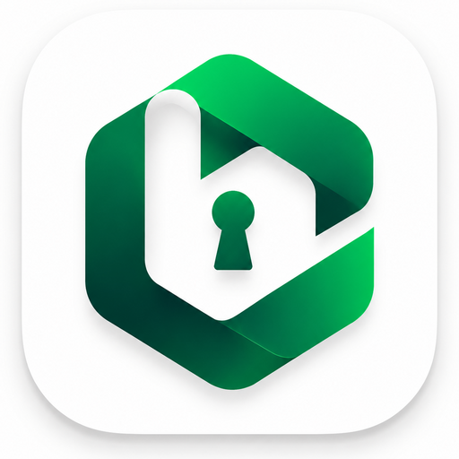

<p align="center">
  
</p>

<h1 align="center">Libs Tunnel</h1>

<p align="center">
  A local-first Android VPN client for VLESS, VMess and Trojan, built on the
  Xray-core engine with a Compose user interface and a headless VPN service.
</p>

<p align="center">
  <a href="LICENSE"></a>
  <a href="https://github.com/yeasinulhoquetuhin/LibsTunnel/releases"></a>
  <a href="https://github.com/yeasinulhoquetuhin/LibsTunnel/actions/workflows/ci.yml"></a>
  
  
</p>

<p align="center">
  <a href="#download">Download</a>
  &nbsp;&middot;&nbsp;
  <a href="#features">Features</a>
  &nbsp;&middot;&nbsp;
  <a href="#supported-protocols-and-transports">Protocols</a>
  &nbsp;&middot;&nbsp;
  <a href="#build-from-source">Build</a>
  &nbsp;&middot;&nbsp;
  <a href="#documentation">Documentation</a>
  &nbsp;&middot;&nbsp;
  <a href="#license">License</a>
</p>

---

Libs Tunnel is a clean-room Android VPN application. It was written from
protocol specifications and public documentation. It contains no code, assets,
keys, branding or configuration from any other application.

The project is split in two: a Go engine that owns the entire network path, and
a Jetpack Compose client that owns consent, storage and the interface. The
client never parses traffic, and the engine never draws anything.

## Why it exists

Most VPN clients for these protocols are closed source, ship with advertising or
analytics, and hide how the tunnel is actually built. Libs Tunnel does the
opposite. The full network path is readable, the build is reproducible from a
single script, and there is no account, no telemetry and no advertising.

## Features

**Tunneling**

- VLESS, VMess and Trojan profiles.
- TCP, WebSocket, gRPC, HTTP Upgrade, SplitHTTP/XHTTP and mKCP transports.
- TLS and REALITY security layers, with configurable SNI and fingerprint.
- A payload injector that runs as part of the Xray connection, so a payload can
  be injected directly into the Xray transport without an external proxy. Four
  modes are available: Direct, Direct with SNI, Proxy, and Proxy with SNI. The
  injector can also add an outer TLS layer and validate the response before the
  stream reaches the protocol handler.
- Per-application routing, so selected apps use the tunnel and the rest do not.
- Custom DNS settings, resolved before the VPN route is installed.
- Configurable MTU, with a safe default of 1500.

**Profiles**

- Import from `vless://`, `vmess://` and `trojan://` share links.
- Encrypted `.libs` export and import for moving profiles between devices.
- A structured editor for every transport, security and flow field.
- Duplicate, rename and delete.

**Interface**

- Jetpack Compose throughout, with light, dark and system themes and six accent
  colours.
- A single screen that shows connection state, throughput, duration and the
  active profile.
- An in-app log view with a clear action, plus a material and dynamic
  colour option.
- A battery-friendly foreground service with a persistent notification.

**Privacy**

- No account, no analytics, no advertising, no crash reporting.
- Credentials stay in application-private storage.
- Nothing is written to a remote service. The only outbound connections are the
  ones a profile explicitly describes.

## Supported protocols and transports

| Category | Supported values |
| --- | --- |
| Protocol | VLESS, VMess, Trojan |
| Transport | TCP, WebSocket, gRPC, HTTP Upgrade, SplitHTTP/XHTTP, mKCP |
| Security | TLS, REALITY, none |
| Flow | XTLS |

The full matrix, including the meaning of each stream setting, is documented in
[docs/reference/protocols.md](docs/reference/protocols.md).

## Download

Release artifacts are published on the
[releases page](https://github.com/yeasinulhoquetuhin/LibsTunnel/releases).

| Version | Architecture | Android | File |
| --- | --- | --- | --- |
| 1.0.0 | `arm64-v8a` | 7.0 and later | [`Libs Tunnel v1.0.0`](https://github.com/yeasinulhoquetuhin/LibsTunnel/releases/tag/v1.0.0) |

Every release publishes a SHA-256 checksum next to the file. Verify it before
installing.

> The published artifact is assembled with the debug signing configuration,
> because no release keystore is included in this repository. The source is
> complete, so anyone can build their own signed variant with
> `scripts/build-android.sh` and their own keystore.

## Build from source

### Requirements

| Tool | Version |
| --- | --- |
| JDK | 17 or newer, verified on 21 |
| Go | 1.26.3 or newer |
| Android SDK | Platform 36 with build-tools |
| Android NDK | Any recent release |
| Gradle | Provided by the bundled wrapper, 8.11.1 |

Set `ANDROID_HOME`, or copy
[android/local.properties.example](android/local.properties.example) to
`android/local.properties` and point `sdk.dir` at your SDK.

### Commands

```bash
git clone https://github.com/yeasinulhoquetuhin/LibsTunnel.git
cd LibsTunnel

sh scripts/build-engine.sh    # runs the Go tests, builds the engine AAR
sh scripts/build-android.sh   # assembles the debug APK
```

The first command writes `android/app/libs/vpncore.aar`. That file is a build
artifact and is deliberately not committed, so every clone rebuilds it from the
Go sources. The second command writes
`android/app/build/outputs/apk/debug/app-debug.apk`.

### Project layout

```text
LibsTunnel/
├── android/                     Android application module
│   ├── app/src/main/java/com/libsvpn/tunnel/
│   │   ├── core/                Bridge to the Go engine
│   │   ├── data/                Profile repository, share-link codec
│   │   ├── engine/              Engine configuration builder
│   │   ├── model/               Profile schema and validation
│   │   ├── service/             Headless VpnService, commands, state bus
│   │   └── ui/                  Compose screens and theme
│   └── gradlew                  Bundled Gradle wrapper
├── engine/                      Go engine
│   ├── cmd/vpncore/             Command line entry point
│   ├── examples/                Safe placeholder profiles
│   ├── manager.go               Lifecycle of Xray, injector and tun2socks
│   ├── injector.go              Payload injection
│   ├── tun.go                   TUN descriptor handling
│   └── xray_config.go           Xray configuration generation
├── scripts/                     Reproducible build commands
├── docs/                        Architecture, build, configuration, reference
├── third_party/                 Dependency inventory and license texts
├── CHANGELOG.md
├── CONTRIBUTING.md
├── LICENSE
└── SECURITY.md
```

## How it works

```text
application traffic
  -> Android TUN descriptor
  -> gVisor TCP and UDP stack
  -> local SOCKS5 inbound
  -> Xray outbound
  -> local payload injector
  -> outer TLS or payload
  -> remote endpoint
```

The injector records the original destination before Xray starts and then points
Xray at a loopback port it owns, so the payload can be inserted below the
protocol layer without knowing which protocol is in use. Every remote socket is
passed through `VpnService.protect` to avoid a routing loop.

The payload injector is part of this chain, not a separate external tool: the
payload is written into the Xray transport itself, in Direct, Direct with SNI,
Proxy or Proxy with SNI mode. A longer explanation is in
[docs/architecture.md](docs/architecture.md) and
[docs/reference/protocols.md](docs/reference/protocols.md).

## Documentation

| Document | Contents |
| --- | --- |
| [docs/README.md](docs/README.md) | Index and recommended reading order |
| [docs/architecture.md](docs/architecture.md) | Components, injector, socket loop prevention |
| [docs/build.md](docs/build.md) | Toolchain and build commands |
| [docs/configuration.md](docs/configuration.md) | Profile schema and the encrypted share format |
| [docs/reference/protocols.md](docs/reference/protocols.md) | Protocol, transport and stream settings |
| [CHANGELOG.md](CHANGELOG.md) | Release history |
| [CONTRIBUTING.md](CONTRIBUTING.md) | How to contribute |
| [SECURITY.md](SECURITY.md) | How to report a vulnerability |

## Not yet exposed

- OpenVPN is not implemented. The reference build examined during development
  did not provide a working OpenVPN backend, so no OpenVPN support is included.
- DNSTT is not implemented.
- SSH tunnelling **is** implemented in the Go engine, and is selected with
  `backend: "ssh"` in a configuration file. The Android profile editor does not
  expose it yet, so it is currently reachable through the `vpncore` command
  only.

## Contributing

Issues and pull requests are welcome. Read
[CONTRIBUTING.md](CONTRIBUTING.md) first, and never include a real server
address, UUID, password, private key or exported profile in an issue or a pull
request.

## License

Libs Tunnel is released under **GPL-3.0-only**. That is the project's own
choice: the pinned dependencies are MPL-2.0 (Xray-core), MIT (tun2socks) and
Apache-2.0 (gVisor), and each of them may be combined into a GPL version 3
work. Xray-core itself remains under MPL-2.0.

If you distribute a binary built from this repository, ship this repository at
a matching tag as the complete corresponding source, as GPL-3.0-only requires.

The full inventory of dependencies, with the exact pinned versions and copies
of their license texts, is in
[third_party/THIRD-PARTY-NOTICES.md](third_party/THIRD-PARTY-NOTICES.md).

## Acknowledgements

- [XTLS/Xray-core](https://github.com/XTLS/Xray-core) for the protocol engine.
- [xjasonlyu/tun2socks](https://github.com/xjasonlyu/tun2socks) for the TUN to
  SOCKS bridge.
- [gVisor](https://gvisor.dev) for the userspace network stack.
- [Jetpack Compose](https://developer.android.com/jetpack/compose) and
  [AndroidX](https://developer.android.com/jetpack/androidx) for the client.

## Author

**Yeasinul Hoque Tuhin**

- <https://tuhinbro.com>
- <https://t.me/TuhinBroh>
- <https://t.me/TDZ_CHAT>
